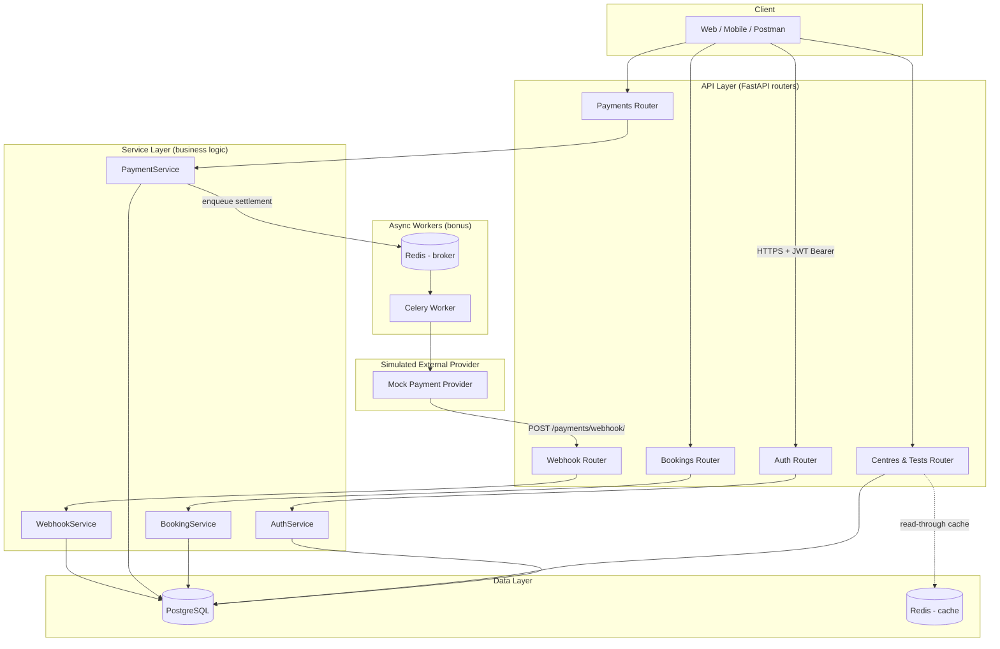
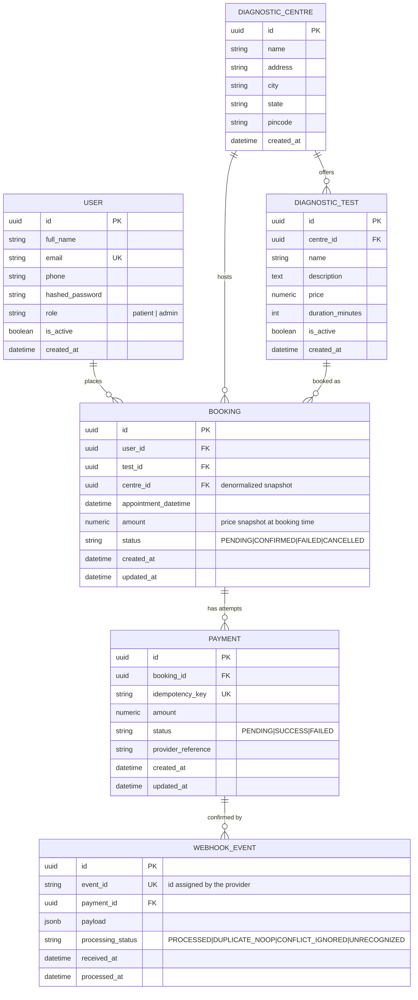
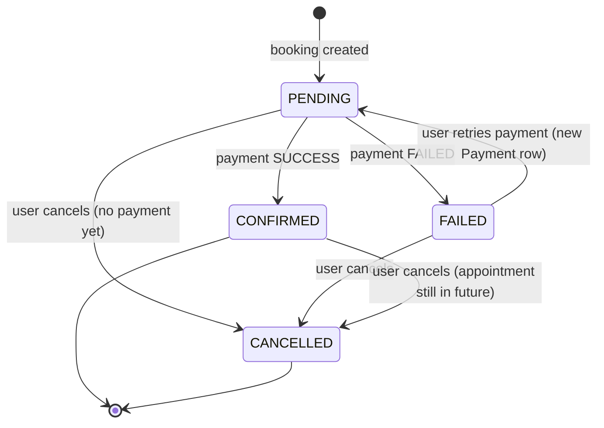

# Diagnostic Test Booking & Payment Simulation — System Architecture

**Purpose of this document:** a complete, implementation-ready system design for the SDE Intern backend
assignment (diagnostic centre bookings + simulated payments). It is written so it can be handed directly
to a code-generation model (or a human) to produce the working service without further design decisions.

---

## 1. Overview

The system lets a registered user browse diagnostic centres and the tests they offer, book a test at a
centre for a given date/time, and pay for that booking through a **simulated** payment flow. Payment
status can arrive two ways — a synchronous mock response and an asynchronous webhook — and both paths must
converge on a single, consistent booking state without ever double-processing an event.

### Core entities
`User → Booking → (DiagnosticTest, DiagnosticCentre) → Payment → WebhookEvent`

### Design priorities (in order)
1. Correctness of booking/payment state under concurrency and duplicate events.
2. Clean, layered API design (routers → services → data access).
3. Explicit, typed data model with sensible constraints at the DB level (not just app level).
4. Testability — business logic isolated from HTTP and easy to unit test.

---

## 2. Goals & Non-Goals

**Goals**
- Signup/login with JWT auth; protected write endpoints.
- CRUD/read APIs for centres and tests; booking creation and lifecycle management.
- A mock payment endpoint and an idempotent webhook endpoint that keep booking state consistent.
- Defensive handling of the edge cases called out in the assignment.

**Non-goals**
- No real payment gateway integration (Stripe/Razorpay), no PII/KYC handling.
- No refund/partial-payment logic — cancellation is a status change, not a money-movement flow.
- No multi-tenant admin dashboard; admin capability is a role flag, not a separate app.

---

## 3. Tech Stack

| Concern | Choice | Reason |
|---|---|---|
| Language/Framework | Python 3.11 + **FastAPI** | Async, Pydantic validation built in, auto Swagger/OpenAPI (bonus item for free), type-safety helps codegen |
| ORM | SQLAlchemy 2.0 (async) | Explicit models, mature migration story |
| Migrations | Alembic | Versioned schema, required for any real DB work |
| DB | **PostgreSQL 15** | Required by brief; row-level locking (`SELECT ... FOR UPDATE`) and partial unique indexes are used for correctness |
| Auth | PyJWT + passlib (bcrypt) | Standard, no framework lock-in |
| Cache (bonus) | Redis | Cache centre/test listings |
| Background jobs (bonus) | Celery + Redis broker | Simulate async payment settlement + webhook retries |
| Docs (bonus) | FastAPI auto Swagger (`/docs`) + ReDoc (`/redoc`) | Free with FastAPI |
| Tests | pytest + httpx `AsyncClient` + pytest-asyncio | Integration tests against a test DB (or SQLite for speed) |
| Containerization | Docker + docker-compose (api, db, redis, worker) | One-command local run |
| Rate limiting (bonus) | slowapi (Redis-backed) | Protect `/auth/*` and `/payments/*` |
| Logging (bonus) | structlog / stdlib logging with JSON formatter + request-id middleware | Traceable requests across services and Celery tasks |

> If Django/DRF is preferred instead, the same layering (routers→services→models) maps to
> (views/serializers→services→models); the data model, state machine and idempotency design below are
> framework-agnostic and don't change.

---

## 4. High-Level Architecture



**Layering rule:** routers only parse/validate HTTP input and call a service method; all business rules
(state transitions, idempotency checks, locking) live in the service layer so they're unit-testable without
spinning up HTTP.

---

## 5. Data Model

### 5.1 Entity-Relationship Diagram



### 5.2 Table Definitions & Key Constraints

**users**
| column | type | constraints |
|---|---|---|
| id | UUID | PK, default `gen_random_uuid()` |
| full_name | varchar(120) | not null |
| email | varchar(255) | unique, not null, indexed |
| phone | varchar(20) | nullable |
| hashed_password | varchar(255) | not null (bcrypt) |
| role | varchar(20) | not null, default `'patient'`, check in (`patient`,`admin`) |
| is_active | boolean | not null, default true |
| created_at | timestamptz | default now() |

**diagnostic_centres**
| column | type | constraints |
|---|---|---|
| id | UUID | PK |
| name | varchar(160) | not null |
| address | text | not null |
| city | varchar(80) | not null, indexed (query filter) |
| state | varchar(80) | nullable |
| pincode | varchar(10) | nullable |
| created_at | timestamptz | default now() |

**diagnostic_tests**
| column | type | constraints |
|---|---|---|
| id | UUID | PK |
| centre_id | UUID | FK → diagnostic_centres.id, not null, indexed |
| name | varchar(160) | not null |
| description | text | nullable |
| price | numeric(10,2) | not null, check (`price >= 0`) |
| duration_minutes | int | nullable |
| is_active | boolean | default true |
| created_at | timestamptz | default now() |

**bookings**
| column | type | constraints |
|---|---|---|
| id | UUID | PK |
| user_id | UUID | FK → users.id, not null, indexed |
| test_id | UUID | FK → diagnostic_tests.id, not null |
| centre_id | UUID | FK → diagnostic_centres.id, not null *(denormalized from test.centre_id at write time — see §16 Assumptions)* |
| appointment_datetime | timestamptz | not null, app-level check: must be in the future at creation |
| amount | numeric(10,2) | not null — **snapshot of `test.price` at booking time**, so later price changes never alter an existing booking |
| status | varchar(20) | not null, default `PENDING`, check in (`PENDING`,`CONFIRMED`,`FAILED`,`CANCELLED`) |
| created_at | timestamptz | default now() |
| updated_at | timestamptz | default now(), updated on every status change |

**payments**
| column | type | constraints |
|---|---|---|
| id | UUID | PK |
| booking_id | UUID | FK → bookings.id, not null, indexed |
| idempotency_key | varchar(120) | **unique**, not null — client- or server-generated key that de-dupes retried payment *initiation* calls |
| amount | numeric(10,2) | not null |
| status | varchar(20) | not null, default `PENDING`, check in (`PENDING`,`SUCCESS`,`FAILED`) |
| provider_reference | varchar(120) | nullable — mock "gateway" transaction id |
| created_at | timestamptz | default now() |
| updated_at | timestamptz | default now() |

`CREATE UNIQUE INDEX ux_one_success_payment_per_booking ON payments (booking_id) WHERE status = 'SUCCESS';`
— a **partial unique index** that makes "at most one successful payment per booking" a hard DB guarantee,
independent of application logic. This is the last line of defense against race conditions.

**webhook_events**
| column | type | constraints |
|---|---|---|
| id | UUID | PK |
| event_id | varchar(120) | **unique**, not null — the provider's event id; this is *the* idempotency key for the webhook |
| payment_id | UUID | FK → payments.id, nullable (nullable so an event referencing an unknown payment can still be recorded for audit) |
| payload | jsonb | not null — raw body, for replay/debugging |
| processing_status | varchar(30) | not null — `PROCESSED`, `DUPLICATE_NOOP`, `CONFLICT_IGNORED`, `UNRECOGNIZED` |
| received_at | timestamptz | default now() |
| processed_at | timestamptz | nullable |

This table is the append-only audit log that makes the webhook idempotent (§9.2) and gives you a debuggable
trail of every event the "provider" ever sent, including duplicates and junk.

---

## 6. Booking State Machine



**Explicitly disallowed transitions** (enforced in `BookingService`, not just left implicit):
- `CONFIRMED → FAILED` / `CONFIRMED → PENDING` — once confirmed, later duplicate or conflicting payment
  events must be no-ops, never a downgrade.
- `CANCELLED → *` — cancellation is terminal.
- Cancelling a `CONFIRMED` booking whose `appointment_datetime` has already passed → rejected (422).

---

## 7. API Design

### 7.1 Conventions
- Base path: `/api/v1`.
- Auth: `Authorization: Bearer <JWT>` header on all endpoints except signup/login/health/webhook.
- Content type: `application/json` everywhere.
- Pagination: `?page=1&page_size=20` (default 20, max 100) on all list endpoints; response wraps results:
  ```json
  { "items": [...], "page": 1, "page_size": 20, "total": 137 }
  ```
- Standard error envelope (see §12) on every non-2xx response.

### 7.2 Auth

| Method | Path | Auth | Description |
|---|---|---|---|
| POST | `/auth/signup` | none | Create a user account |
| POST | `/auth/login` | none | Exchange credentials for a JWT |
| GET | `/auth/me` | required | Return the current user's profile |

`POST /auth/signup`
```json
// Request
{ "full_name": "Asha Rao", "email": "asha@example.com", "phone": "9876543210", "password": "S3cure!Pass" }

// 201 Response
{ "id": "b1f9...", "full_name": "Asha Rao", "email": "asha@example.com", "role": "patient", "created_at": "2026-09-27T10:00:00Z" }
```
Validation: email format + uniqueness (409 on duplicate), password min length 8, phone optional but format-checked if present.

`POST /auth/login`
```json
// Request
{ "email": "asha@example.com", "password": "S3cure!Pass" }

// 200 Response
{ "access_token": "eyJhbGciOi...", "token_type": "bearer", "expires_in": 3600 }
```
Wrong credentials → `401` with a generic "invalid email or password" message (never reveal which field was wrong).

### 7.3 Centres & Tests

| Method | Path | Auth | Description |
|---|---|---|---|
| GET | `/centres/` | none | List centres, filter by `city`, paginated |
| GET | `/centres/{centre_id}` | none | Centre detail |
| GET | `/centres/{centre_id}/tests` | none | Tests offered at a centre |
| GET | `/tests/` | none | List all tests, filter by `name`, `city`, `min_price`, `max_price` |
| GET | `/tests/{test_id}` | none | Test detail (includes centre summary) |
| POST | `/centres/` | admin | Create a centre |
| POST | `/centres/{centre_id}/tests` | admin | Add a test to a centre |
| PATCH | `/tests/{test_id}` | admin | Update price / deactivate a test |

Read endpoints are public (browsing doesn't need auth, matching how a real diagnostics marketplace works);
only mutation is admin-gated via the `role` claim in the JWT. Read endpoints are the cache candidates
(§14).

`GET /tests/{test_id}` — 200 response:
```json
{
  "id": "t-001",
  "name": "Complete Blood Count (CBC)",
  "description": "Full blood panel",
  "price": "499.00",
  "duration_minutes": 15,
  "is_active": true,
  "centre": { "id": "c-001", "name": "HealthFirst Diagnostics", "city": "Bengaluru" }
}
```

### 7.4 Bookings

| Method | Path | Auth | Description |
|---|---|---|---|
| POST | `/bookings/` | user | Create a booking (status → `PENDING`) |
| GET | `/bookings/` | user | List **own** bookings, filter by `status`, paginated |
| GET | `/bookings/{booking_id}` | owner or admin | Booking detail |
| PATCH | `/bookings/{booking_id}/cancel` | owner | Cancel a cancellable booking |
| GET | `/bookings/{booking_id}/payments` | owner or admin | Payment attempts for a booking |

`POST /bookings/`
```json
// Request
{ "test_id": "t-001", "appointment_datetime": "2026-10-05T09:30:00Z" }

// 201 Response
{
  "id": "bk-9f21",
  "test_id": "t-001",
  "centre_id": "c-001",
  "appointment_datetime": "2026-10-05T09:30:00Z",
  "amount": "499.00",
  "status": "PENDING",
  "created_at": "2026-09-27T10:05:00Z"
}
```
Validation: `test_id` must exist and be `is_active`; `appointment_datetime` must be in the future
(reject with `422` otherwise); `amount` is server-computed from the test's current price — **never accepted
from the client**.

`PATCH /bookings/{booking_id}/cancel` → `200` with updated booking, or:
- `403` if the requester doesn't own the booking,
- `404` if it doesn't exist,
- `422` if status is already `CANCELLED` or the appointment has passed.

### 7.5 Payments

| Method | Path | Auth | Description |
|---|---|---|---|
| POST | `/payments/` | user | Initiate a (simulated) payment for a booking |
| GET | `/payments/{payment_id}` | owner or admin | Payment status |

`POST /payments/`
```json
// Request
{ "booking_id": "bk-9f21", "idempotency_key": "client-generated-uuid-optional" }

// 200 Response (either outcome uses the same shape)
{
  "payment": {
    "id": "pay-771a",
    "booking_id": "bk-9f21",
    "amount": "499.00",
    "status": "SUCCESS",
    "provider_reference": "mock_txn_5c1e"
  },
  "booking": { "id": "bk-9f21", "status": "CONFIRMED" }
}
```
If `idempotency_key` is omitted, the server derives one deterministically as `booking:{booking_id}:init`
so an accidental double-click / client retry of the *same* request cannot create two `Payment` rows for a
still-`PENDING` booking (see §9.1).

Failure modes:
- `404` — booking not found.
- `403` — booking belongs to another user.
- `409` — booking is not in `PENDING` (already paid, cancelled, or failed-needs-explicit-retry-endpoint).

### 7.6 Webhook

| Method | Path | Auth | Description |
|---|---|---|---|
| POST | `/payments/webhook/` | shared-secret header (`X-Webhook-Signature`), **not** user JWT | Async status push from the mock provider |

```json
// Request (as sent by the simulated provider)
{
  "event_id": "evt_8f3a1c",
  "payment_id": "pay-771a",
  "booking_id": "bk-9f21",
  "status": "SUCCESS",
  "occurred_at": "2026-09-27T10:06:02Z"
}
```
Always responds `200 OK` for anything it can parse and file into `webhook_events` — including duplicates —
so the provider's retry logic doesn't keep hammering a legitimately-handled event. See §9.2 for the full
algorithm.

---

## 8. Authentication & Security Design

- **Password storage:** bcrypt via passlib, cost factor 12.
- **JWT:** HS256 (single-service, no need for asymmetric keys), claims: `sub` (user id), `role`, `iat`,
  `exp` (60 min). No refresh token in v1 (documented as a future improvement, §17) — client just re-logs-in.
- **Authorization:** a `get_current_user` FastAPI dependency decodes/validates the JWT and loads the user;
  a `require_admin` dependency wraps it for admin-only routes. Ownership checks (booking/payment belongs to
  `current_user.id`) happen in the service layer, not the router, so they're covered by unit tests.
- **Input validation:** every request body is a Pydantic model with field-level constraints (`EmailStr`,
  `Decimal` with `gt=0`, `datetime` with a custom future-date validator, string length limits). FastAPI
  turns validation failures into `422` automatically.
- **Webhook auth:** since it's not a real user, it's authenticated with a shared secret
  (HMAC signature over the raw body, header `X-Webhook-Signature`) rather than JWT — mirrors how real
  payment providers (Stripe, Razorpay) sign webhooks. Requests with a bad/missing signature → `401`,
  logged, and **not** written to `webhook_events` (so they can't be used to probe idempotency behavior).

---

## 9. Payment Simulation & Idempotency Design

This is the part the assignment weights most heavily on edge cases, so it's specified as pseudocode, not
just prose.

### 9.1 `POST /payments/` idempotency (client-initiated path)

```
BEGIN TRANSACTION
  booking = SELECT * FROM bookings WHERE id = :booking_id FOR UPDATE   -- row lock
  IF booking IS NULL: ROLLBACK; RETURN 404
  IF booking.user_id != current_user.id: ROLLBACK; RETURN 403
  IF booking.status != 'PENDING': ROLLBACK; RETURN 409 "booking not payable"

  existing = SELECT * FROM payments WHERE idempotency_key = :key
  IF existing EXISTS:
      COMMIT  -- nothing new to do
      RETURN 200 with existing payment + booking   -- safe retry, no duplicate row

  payment = INSERT INTO payments (booking_id, idempotency_key, amount, status='PENDING')

  outcome = simulate_provider(amount)   -- SUCCESS or FAILED (see below)

  UPDATE payments SET status = outcome, provider_reference = mock_ref() WHERE id = payment.id
  UPDATE bookings SET status = (CONFIRMED if outcome == SUCCESS else FAILED) WHERE id = booking.id
COMMIT
RETURN 200 with payment + booking
```

**`SELECT ... FOR UPDATE` on the booking row** is what prevents two concurrent requests (e.g. a double
click, or the client retrying while the first request is still in flight) from both reading `PENDING` and
both writing a "successful" confirmation.

**Simulating an outcome:** default is weighted random (e.g. 85% `SUCCESS` / 15% `FAILED`) so behavior is
realistic; for deterministic testing, accept an optional `force_outcome` field in the request body **only
when running with `DEBUG=true`**, so automated tests can assert both branches without relying on chance.

### 9.2 Webhook idempotency (provider-initiated path)

```
verify HMAC signature; IF invalid: RETURN 401  (do not record)

BEGIN TRANSACTION
  TRY:
      INSERT INTO webhook_events (event_id, payment_id, payload, processing_status='RECEIVED')
  EXCEPT unique_violation on event_id:
      COMMIT
      RETURN 200  -- already seen this exact event before; true no-op, nothing else touched

  payment = SELECT * FROM payments WHERE id = :payment_id FOR UPDATE
  IF payment IS NULL:
      UPDATE webhook_events SET processing_status='UNRECOGNIZED' WHERE event_id = :event_id
      COMMIT
      RETURN 200   -- ack so the provider stops retrying; alert/log for ops to investigate

  IF payment.status != 'PENDING':
      -- payment was already settled (by the sync path, or an earlier webhook)
      IF payment.status == incoming.status:
          mark event 'DUPLICATE_NOOP'      -- same outcome arriving again, harmless
      ELSE:
          mark event 'CONFLICT_IGNORED'    -- e.g. late FAILED after we already confirmed SUCCESS
                                            -- business rule: first settlement wins, booking is never
                                            -- downgraded from CONFIRMED by a late/out-of-order event
      COMMIT
      RETURN 200

  -- first time this payment is actually being settled
  booking = SELECT * FROM bookings WHERE id = payment.booking_id FOR UPDATE
  UPDATE payments SET status = incoming.status WHERE id = payment.id
  UPDATE bookings SET status = (CONFIRMED if incoming.status=='SUCCESS' else FAILED) WHERE id = booking.id
  UPDATE webhook_events SET processing_status='PROCESSED', processed_at=now() WHERE event_id = :event_id
COMMIT
RETURN 200
```

Three independent safety nets, deliberately layered so no single one has to be perfect:
1. **`event_id` unique constraint** — catches exact duplicate deliveries (the case the assignment calls out explicitly).
2. **`payment.status != PENDING` check** — catches a *different* event about a payment that's already resolved (e.g. sync path already confirmed it before the async webhook arrived).
3. **Partial unique index on `payments(booking_id) WHERE status='SUCCESS'`** — a hard DB-level backstop if the above logic ever has a bug or runs outside a transaction by mistake.

### 9.3 Concurrency notes
- All multi-row updates happen inside one DB transaction with explicit `FOR UPDATE` locks on the rows being
  transitioned — this is what makes "repeated webhook" and "double payment" safe, not just careful ordering
  of application code.
- Row locks are held only for the duration of the transaction (a few ms for a mock provider), so this
  doesn't become a throughput bottleneck at assignment scale.

---

## 10. Edge Case Matrix

| Scenario | Handling | HTTP status |
|---|---|---|
| Signup with existing email | Reject | 409 |
| Login with wrong password | Generic error, no field hints | 401 |
| Missing/expired/malformed JWT | Reject before hitting a route | 401 |
| Booking a non-existent or inactive test | Reject | 404 / 422 |
| Booking with a past `appointment_datetime` | Reject | 422 |
| Booking with client-supplied `amount` | Ignored — server computes it | n/a (field not accepted) |
| Paying for someone else's booking | Ownership check in service layer | 403 |
| Paying a booking that isn't `PENDING` | Reject | 409 |
| Retried `POST /payments/` with same idempotency key | Return the original result, no new row | 200 |
| Duplicate webhook `event_id` | No-op, logged, ack'd | 200 |
| Webhook for unknown `payment_id` | Recorded as `UNRECOGNIZED`, ack'd, alert for ops | 200 |
| Webhook with bad signature | Rejected, not recorded | 401 |
| Out-of-order/conflicting webhook after settlement | `CONFLICT_IGNORED`, booking never downgraded | 200 |
| Cancel an already-cancelled booking | Reject | 422 |
| Cancel a `CONFIRMED` booking after the appointment passed | Reject | 422 |
| Invalid pagination params (`page=0`, huge `page_size`) | Clamp to valid range, don't error | 200 |
| Malformed JSON body | Reject via Pydantic validation | 422 |
| Non-admin hitting an admin-only endpoint | Reject | 403 |
| Rate limit exceeded on `/auth/*` or `/payments/*` | Reject | 429 |

---

## 11. Project Structure

```
app/
├── main.py                     # FastAPI app factory, router registration, middleware
├── core/
│   ├── config.py                # pydantic Settings (env vars)
│   ├── security.py              # JWT encode/decode, password hashing
│   ├── database.py              # async engine/session factory
│   ├── logging.py                # structured logging + request-id middleware
│   └── exceptions.py             # domain exceptions -> HTTP mapping
├── models/                       # SQLAlchemy ORM models
│   ├── user.py  centre.py  test.py  booking.py  payment.py  webhook_event.py
├── schemas/                       # Pydantic request/response models
│   ├── auth.py  centre.py  test.py  booking.py  payment.py  common.py (pagination, error envelope)
├── api/v1/
│   ├── deps.py                    # get_db, get_current_user, require_admin
│   ├── router.py                  # aggregates all routers
│   └── endpoints/
│       ├── auth.py  centres.py  tests.py  bookings.py  payments.py  webhooks.py  health.py
├── services/                       # business logic, framework-agnostic
│   ├── auth_service.py  booking_service.py  payment_service.py  webhook_service.py
├── tasks/                           # Celery tasks (bonus: async settlement + retries)
│   └── payment_tasks.py
├── tests/
│   ├── conftest.py                  # fixtures: test db, test client, factory users
│   ├── test_auth.py  test_bookings.py  test_payments.py  test_webhooks.py  test_edge_cases.py
alembic/                               # migrations
docker-compose.yml                      # api, db, redis, worker
Dockerfile
requirements.txt / pyproject.toml
.env.example
README.md
```

---

## 12. Error Handling Convention

Every non-2xx response uses the same envelope so clients can handle errors generically:
```json
{
  "error": {
    "code": "BOOKING_NOT_PAYABLE",
    "message": "This booking is not in a payable state.",
    "details": { "current_status": "CANCELLED" }
  }
}
```
Domain exceptions (`BookingNotFoundError`, `BookingNotPayableError`, `NotOwnerError`, …) are raised in the
service layer and mapped to HTTP status + `code` by a single FastAPI exception handler in
`core/exceptions.py` — routers never build error JSON by hand.

---

## 13. Testing Strategy

- **Unit tests** for services with the DB session mocked/rolled back per test — cover every state
  transition in §6 and every branch of the idempotency pseudocode in §9.
- **Integration tests** using `httpx.AsyncClient` against the real FastAPI app + a disposable Postgres
  (or SQLite for speed) test database, one DB transaction per test rolled back at teardown.
- **Explicit idempotency tests:**
  - POST the same webhook payload twice → assert exactly one `Payment`/`Booking` mutation and a 200 both times.
  - POST `/payments/` twice with the same `idempotency_key` → assert only one `Payment` row exists.
  - Fire a `SUCCESS` webhook then a `FAILED` webhook for the same payment → assert booking stays `CONFIRMED`.
- **Edge-case tests** mirroring the table in §10 one-to-one, so the test suite is a literal checklist against the assignment's grading rubric.

---

## 14. Bonus Engineering Notes

- **Redis caching:** `GET /centres/` and `GET /tests/` are cached (key includes filter params) with a short
  TTL (e.g. 60s) and explicitly invalidated on admin create/update — read-heavy, low-write data is the
  textbook cache case.
- **Celery:** `POST /payments/` can optionally enqueue settlement instead of resolving synchronously, to
  demonstrate the fully-async path end-to-end (task calls the internal webhook handler after a simulated
  delay); Celery's built-in retry/backoff is used to demonstrate "retry handling for webhook processing."
- **Rate limiting:** slowapi, Redis-backed, per-IP and per-user limits on `/auth/login` (brute-force) and
  `/payments/` (abuse).
- **Structured logging:** JSON logs with a `request_id` generated per request (middleware) and propagated
  into Celery task logs, so a booking/payment/webhook trio can be traced end-to-end.
- **Docker Compose services:** `api`, `db` (Postgres), `redis`, `worker` (Celery) — one `docker-compose up`
  boots the whole stack; migrations run as a one-off `alembic upgrade head` entrypoint step.

---

## 15. Configuration / Environment Variables

```
DATABASE_URL=postgresql+asyncpg://user:pass@db:5432/diagnostics
JWT_SECRET_KEY=change-me
JWT_ALGORITHM=HS256
JWT_EXPIRE_MINUTES=60
WEBHOOK_SIGNING_SECRET=change-me-too
REDIS_URL=redis://redis:6379/0
DEBUG=false
PAYMENT_SUCCESS_RATE=0.85
```

---

## 16. Assumptions

1. A `DiagnosticTest` belongs to exactly one `DiagnosticCentre` (no shared/multi-centre tests).
2. `Booking.centre_id` is stored redundantly alongside `test_id` purely for query convenience (list "my
   bookings by centre" without a join) — it's set once at booking creation from `test.centre_id` and never
   changes afterward, so it can't drift from the true source of truth.
3. `Booking.amount` is a **price snapshot**, not a live reference — a later price change on the test must
   not alter historical or in-flight bookings.
4. One booking may have multiple `Payment` rows over time (failed attempt → retry), but at most one may
   ever reach `SUCCESS` (enforced by the partial unique index in §5.2).
5. "Admin" is a role flag on `User`, not a separate table — sufficient for this assignment's scope.
6. The mock payment provider and the webhook sender are both simulated within this same service (e.g. a
   background task), since no real external provider exists.

---

## 17. What Would Be Improved With More Time

- Refresh tokens + token revocation/blacklist (logout that actually invalidates a token).
- Idempotency-Key support as a proper HTTP header convention (`Idempotency-Key`) reusable across all
  mutating endpoints, not just payments.
- Outbox pattern for the webhook sender side, so "provider" events are guaranteed-at-least-once by
  construction rather than by a single background task.
- Soft-delete / audit trail (who changed a booking's status and when) instead of just `updated_at`.
- Proper multi-region/read-replica story if traffic ever justified it — out of scope at this size.
- OpenTelemetry tracing across API → Celery → "provider" for full distributed tracing, beyond structured logs.
